# Retail_And_Inventory_Analysis

## Project Overview
This project analyzes retail sales and inventory data from Maven Toys Mexico using SQL and Power BI. The goal is to examine sales performance, revenue, gross profit, product categories, store performance, inventory indicators and potential investment opportunities.

The project includes a relational SQL database, business queries, scenario-based analysis and an interactive Power BI dashboard.

## Tools Used:
- SQL
- PowerBI
- Excel
- Github

## Project Structure
- `SQL/`: contains database scripts, data insertion scripts, and business queries.
- `screenshots/`: contains screenshots of SQL query results.
- `README.md`: presents the project overview, business questions, results, and insights.
- `powerbi/`: contains the Power BI dashboard file and dashboard overview image.

## Database Overview
The Database includes data from sales, inventory, store city and location, name of store, products, category of products and the date of transactions.
The main tables are : 

- 'sales',
- 'stores',
- 'inventory',
- 'products',
- 'calendar'.

A SQL view named 'vw_sales_analysis' was created in order to include tables of sales, stores, inventory, products, calendar.

## Business Questions and SQL Results
### Query 1: Which store generated the highest total revenue during the available sales period?
**SQL Concepts Used:**

SUM, GROUP BY, ORDER BY

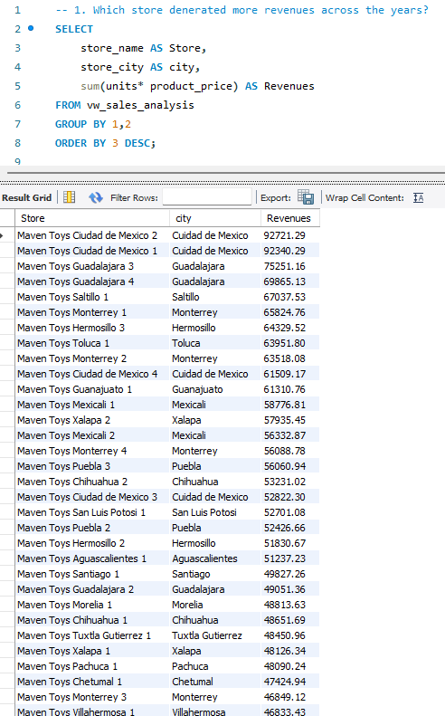

** Insight: **

The most profitable stores are in two cities: Cuidad de Mexico, Guadalajara. These two cities should be a candidate if they want to invest to another store.

### Query 2: Which product generate the highest revenues?
**SQL Concepts Used:**

SUM, GROUP BY, ORDER BY

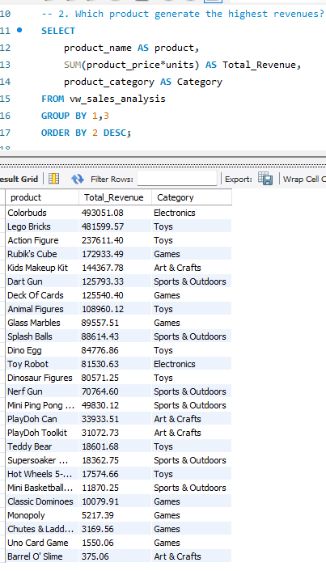 

** Insight: **

This query shows the products and the categories that make the most revenues. The categories that can make the business more profitable are electronics, games and toys.

### Query 3: Which product has the highest Gross Profit Margin %
**SQL Concepts Used:**

SUM, ROUND, GROUP BY, ORDER BY

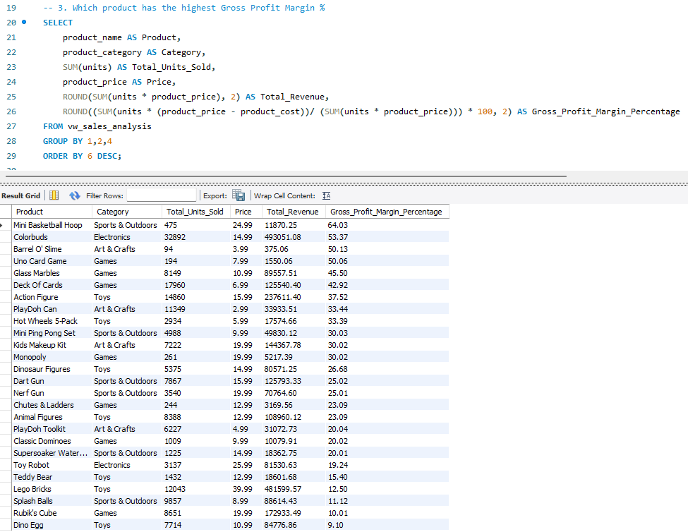

** Insight: **

This query calculates the Gross Profit Margin percentage of each product. This KPI can help us to understand which of the products can be able to make more profit for the company.

### Query 4: This query identifies the city that generates the highest total revenue.
**SQL Concepts Used:**

SUM, GROUP BY, ORDER BY

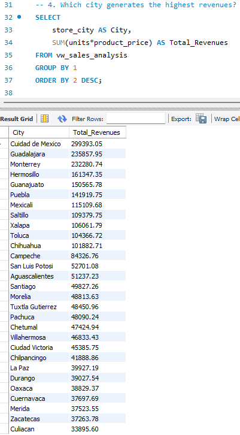 

** Insight: **

This query aims to approve the most profitable city. The outcomes can be used for investment or marketing campaingns and also can help the company to understand the market power of each city.

### Query 5: Top-5 store-category revenue combinations
**SQL Concepts Used:**

SUM, GROUP BY, ORDER BY, LIMIT

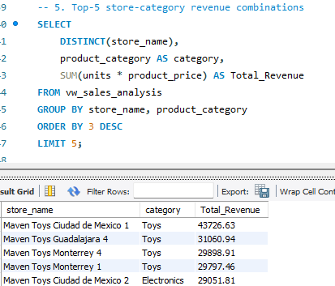 

** Insight: **

This query combines the 5 most profitables stores and categories. The outcomes show the categories of products that every store make the most revenues. This outcomes also can help the company to understand the demand of each category in order to make more campaignes. Moreover, it is helpful in terms of investment. The company should take into account the most profitable categories and invest more to them. Further, the categories that they dont make a lot of money to the company should be reconsidered.

### Query 6: What is the Gross Profit Margin of each store?
**SQL Concepts Used:**

ROUND, SUM, GROUP BY, ORDER BY

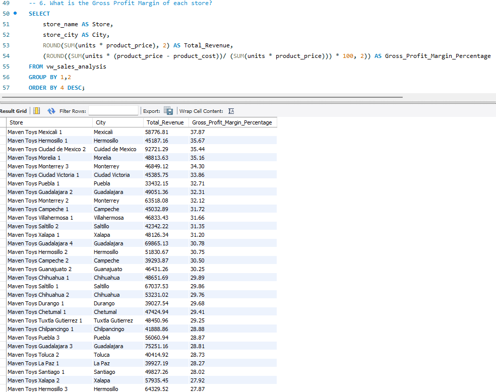 

** Insight: **

This query identifies the stores with the highest gross profit margin percentage. The purpose of this query is to understand which stores are the most profitable in percentage terms, not only which generate the highest revenue. Stores with a high gross profit margin can be prioritized for promotion, pricing strategy, or further investment, especially if they also generate strong sales volume.

### Query 7:  Which product categories have the highest and lowest Gross Profit Margins?
**SQL Concepts Used:**

CASE, GROUP BY, SUM, ORDER BY

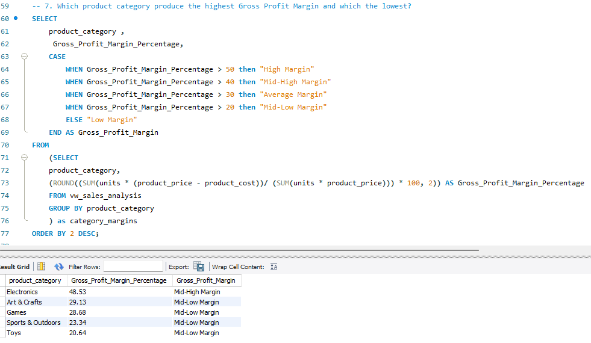

** Insight: **

This query categorize every product category by taking into account the highest Gross Profit Margin of each category. The query helps the company to understand how important every product is in revenues. The most profitable category is Electronics and Art & Craft. 

### Query 8: Which products may need to be reconsidered due to low Gross Profit Margin?
**SQL Concepts Used:**

CASE, SUM, GROUP BY, ORDER BY, ROUND

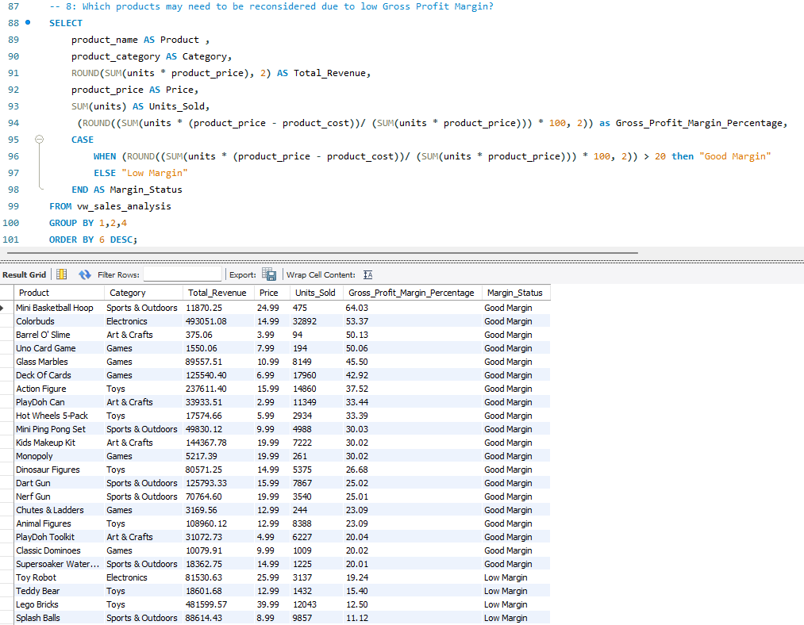 

** Insight: **

One of the most powerful business queries of the project. This query identifies the importance of every product in revenues of the company. It takes into account the total units that have sold across the stores, the price of each unit and the total revenue of each product. Moreover, apart from the most powerful products, show the most weak products that should be reconsidered. So, the company should categorize these products in order to do more marketing campaigns.

### Query 9: Which existing market would be the best candidate for opening a new store based on current sales performance?
**SQL Concepts Used:**

COUNT, ROUND, SUM, GROUP BY, ORDER BY

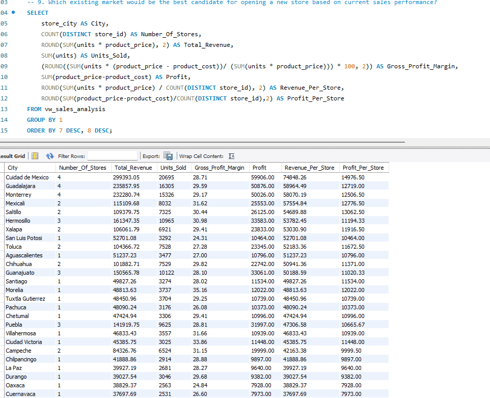

** Insight: **

This query evaluates which existing city could be the best candidate for opening an additional store. The analysis compares total revenue, gross profit, gross profit margin, total units sold, number of existing stores, revenue per store and profit per store. The purpose of this query is not only to identify the city with the highest total revenue, but also to understand which city performs well on a per-store basis.

### Query 10: Which product categories perform best by month during the available sales period?
**SQL Concepts Used:**

YEAR, MONTH, SUM, ROUND, GROUP BY, ORDER BY

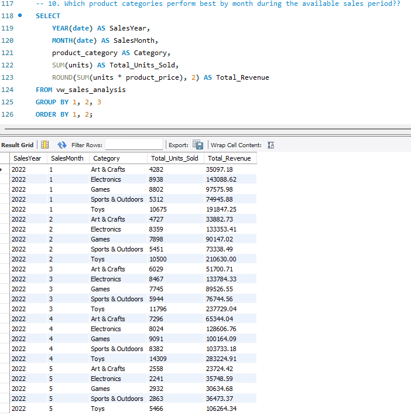

** Insight: **

This query examines the total sales and total revenues of each product category for every month. The available data of the dataset are until May 2022. So, the outcomes can be categorized until then. For every month, the query shows the highest category and the lowest. It can be used to show the most efficient product of every month.

### Query 11: Which is the highest sales category of each city?
**SQL Concepts Used:**

SUM, FROM, GROUP BY

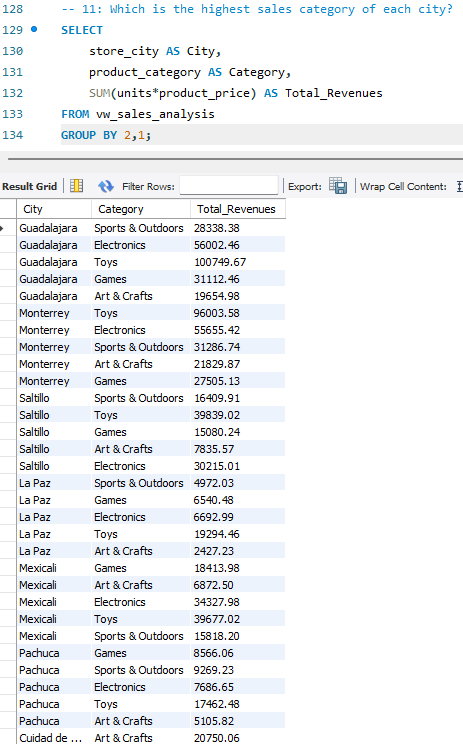

** Insight: **

The query shows the total revenues of every category in every city. It is one of the most helpful queries, because it shows the categories which contiboute more to the total revenues in every city. So, it could be a different market targetting in every category in order to enhance the profitabillity.  

## Query 12: Scenario: Which store location type should be prioritized for future expansion?
**SQL Concepts Used:**

COUNT, ROUND, SUM, GROUP BY, ORDER BY

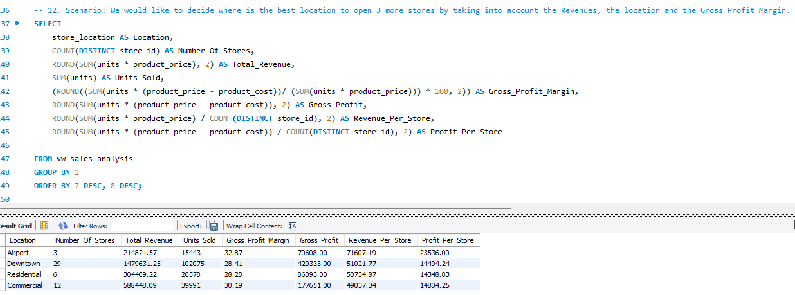

** Insight: **

The query is the first business scenario of the project. It contains outcomes which help the business to decide where is the best location to open more stores. It takes into account the Gross Profit Margin, the total units that sold in each location, the total revenues and also the profit and the revenue per store. The most profitable stores are these which located in the airports. So, an additional store in another airport is a candidate. The second best location is downtown, where the business has the most of the stores. 

## Query 13: Scenario: Which product category should be prioritized for new product investment?
**SQL Concepts Used:**

COUNT, SUM, ROUND, GROUP BY, ORDER BY

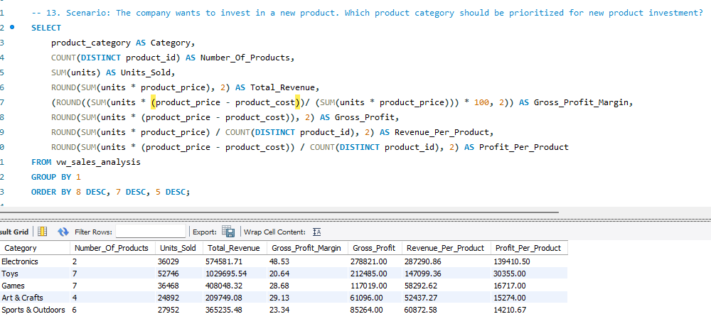

** Insight: **

In this scenario, the company wants to invest in a new product. In order to complete this purpose should take into account the profitability of each category. Electronics category offer the most value Gross Profit Margin, the highest profit per product and revenue per product. So, this query helps to identify which product should be prioritized for a potential investment by focusing on sales volume, Gross Profit Margin, total revenues, revenues per product and profit per product. 

## Query 14: Scenario: The company wants to prioritize the restocking of products that perform high sales.
**SQL Concepts Used:**

SUM, MAX, ROUND, CASE, JOIN, GROUP BY, ORDER BY

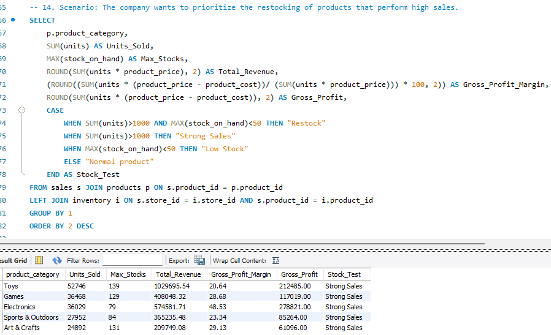

** Insight: **

The company wants to identify which of the products should be restocked as they perform high sales. It contains a CASE statement, which help the company to understand which of the products should be restocked. Products with high units sold and low available stock may require restocking attention, while products with strong revenue and gross profit may be good candidates for further commercial focus. The outcomes of the query show that restocking is not required, a fact which highlight that the strategy of the company in terms of restocking is good.  

## Key Insights

* The highest revenue-generating stores are located in Ciudad de Mexico and Guadalajara, making these cities strong candidates for further commercial investment.
* Electronics, Games, and Toys are among the strongest revenue-generating categories.
* Gross Profit Margin analysis shows that revenue alone is not enough to evaluate performance; some stores and categories perform better in profitability terms.
* Airport locations show strong profitability and could be considered for future store expansion.
* Based on the restocking analysis, current inventory levels appear sufficient for high-performing products, suggesting that the company’s restocking strategy is generally effective.

## Power BI Dashboard

A Power BI Dashboard was created to visualize the performance of the company. 

The dashboard incudes:
- An overview of financial performance
- Total Revenue per category
- Gross Profit per category
- Product Performance Analysis
- Top Products by Units Sold
- Store & Location Analysis

### Executive Overview

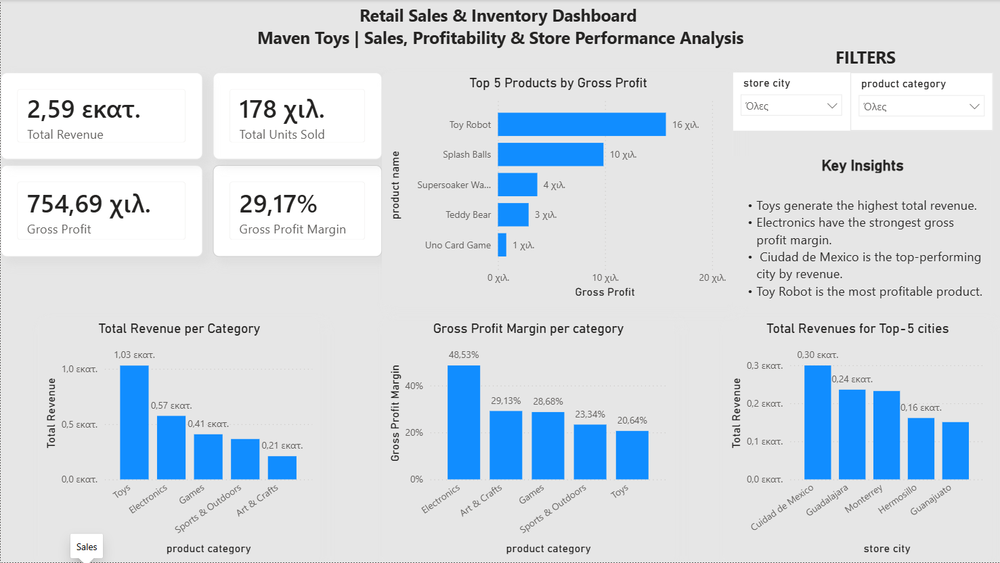

### Product Performance Analysis

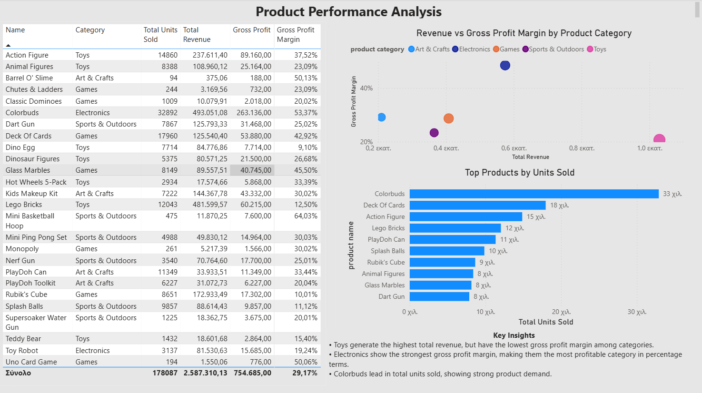

### Store & Location Performance Analysis

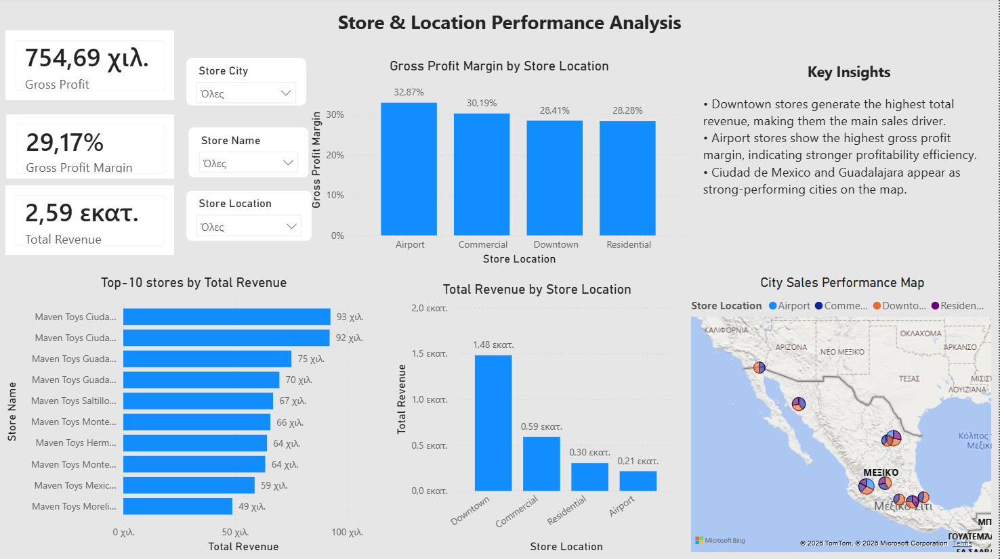

